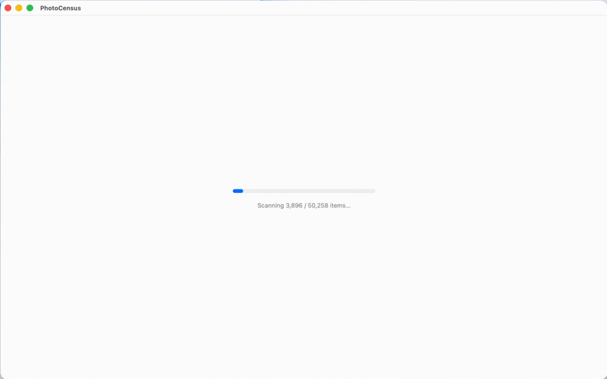
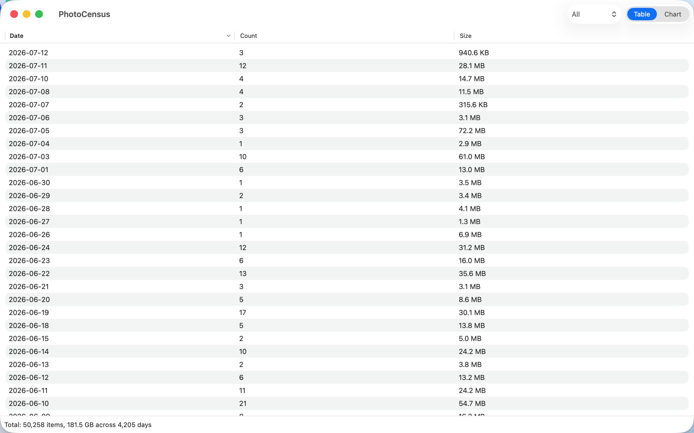
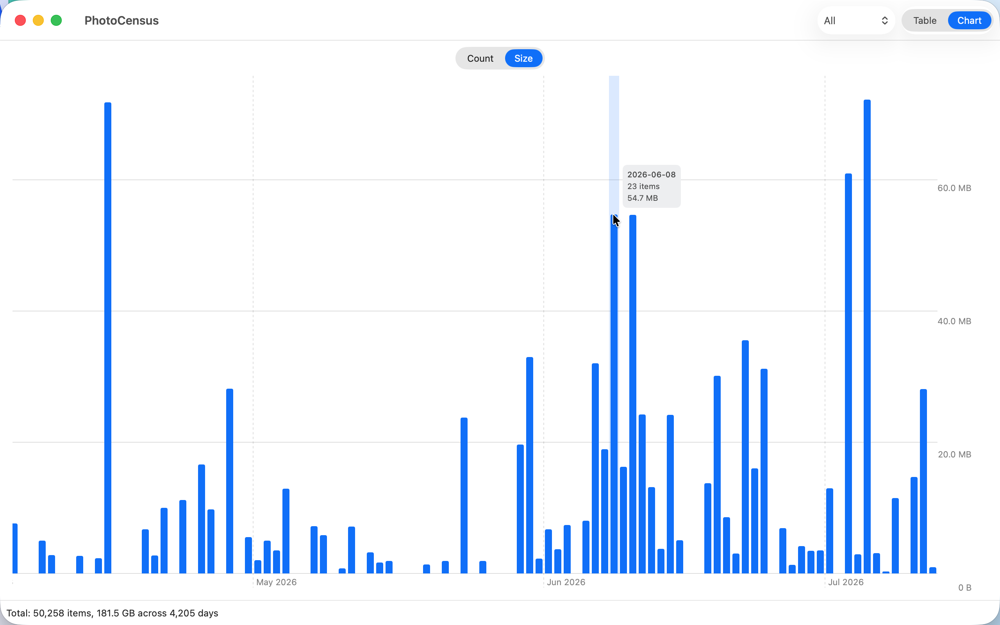

  

<h1 align="center">PhotoCensus</h1>

<strong>写真を、日ごとに数え上げる。</strong>

macOS の Photos ライブラリ内の写真を日付ごとにカウントし、件数と合計ファイル
サイズをソート可能なテーブル、棒グラフ、日別のサムネイル閲覧で表示するネイ
ティブ macOS アプリ。

SwiftUI + PhotoKit で構築。macOS 14 以降が必要。

[English README](README_en.md)

  

  
  

## 機能

- 日付ごとの写真枚数と合計オリジナルファイルサイズ（10 進単位、Finder と同じ）
- ソート可能なテーブル（日付 / 件数 / サイズ）と、絞り込み用ドロップダウン
  （すべて / 写真のみ / RAW のみ）
- 棒グラフ（Swift Charts）。件数/サイズを切り替えるメトリック切替、日付範囲
  全体を横スクロールで表示、表示範囲に合わせて再スケールする固定 y 軸、
  日付・件数・サイズを表示するホバーツールチップ
- テーブルの行またはグラフの棒をクリックすると、その日の写真をサムネイルで
  閲覧できる
- テーブル/グラフ、件数/サイズの切り替えは、カスタムのアニメーション付き
  スライド式コントロールで行う

## インストール

[Releases](../../releases) から最新の dmg をダウンロードして開き、
PhotoCensus.app を Applications にドラッグする。

**注意:** このアプリは notarize されていない。初回起動時はアプリを右クリック
して「開く」を選択するか、以下を実行する:

    xattr -dr com.apple.quarantine /Applications/PhotoCensus.app

## ソースからビルド

    brew install xcodegen
    cd PhotoCensus && xcodegen generate
    xcodebuild -project PhotoCensus.xcodeproj -scheme PhotoCensus build

または生成された `PhotoCensus.xcodeproj` を Xcode で開く。

アプリアイコンは `assets/icon/gen_icon.py` により SVG ソースから生成される
（`assets/icon/` を参照）。

## 既知の制限

- システムの Photos ライブラリのみサポート（PhotoKit の制約）。旧 CLI は
  `--library` によるカスタムライブラリ指定に対応している。
- グループ化に使う日付フィールドは写真の撮影日（`creationDate`）に固定。
  旧 CLI の `--date-field`（撮影日 / 元の EXIF 日付 / 追加日の選択）に相当
  する機能は PhotoKit にはない。
- 日付グループ化は Mac のローカルタイムゾーン基準。写真ごとの撮影タイム
  ゾーンは PhotoKit では取得できないため、海外撮影分は Photos.app / 旧 CLI
  と日付が 1 日ずれる場合がある。
- 旧 CLI のデバッグ用オプション（`--debug` / `--debug-date` /
  `--diagnose-tz`）に相当する機能はアプリにはない。
- オリジナルファイルサイズが不明な項目（例: iCloud から未ダウンロードの
  オリジナル）は件数には含まれるがサイズ合計には含まれない。件数はステータス
  バーに表示される。
- カウントはアプリ起動時点のスナップショット。PhotoCensus 実行中に
  Photos.app で写真を追加・削除しても、アプリを再起動するまで反映されない。
  日別サムネイル画面はライブラリから都度取得するため、その場合テーブルの
  件数と表示されるサムネイルの数が食い違うことがある。

## 旧 Python CLI

オリジナルのコマンドライン版は [legacy/](legacy/) にあり、引き続き動作する。
[legacy/README.md](legacy/README.md) を参照。

## リリース

    git tag v0.1.0 && git push origin v0.1.0

GitHub Actions が dmg をビルドしてリリースに添付する。

## ライセンス

[MIT License](LICENSE)
